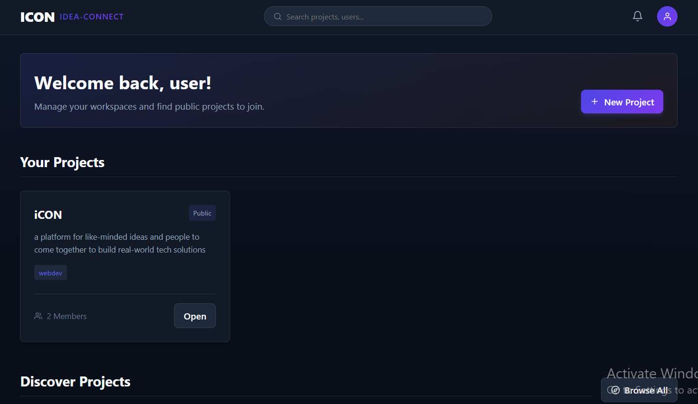
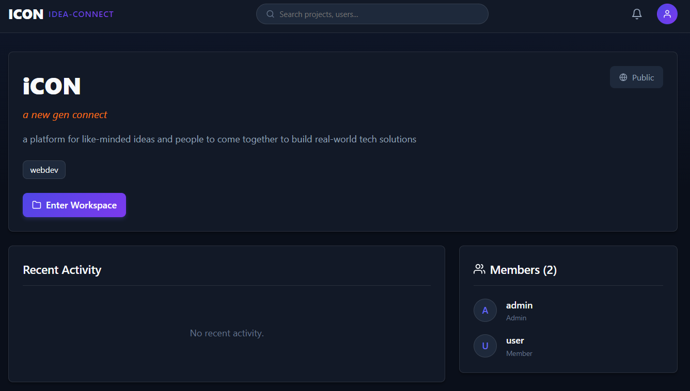
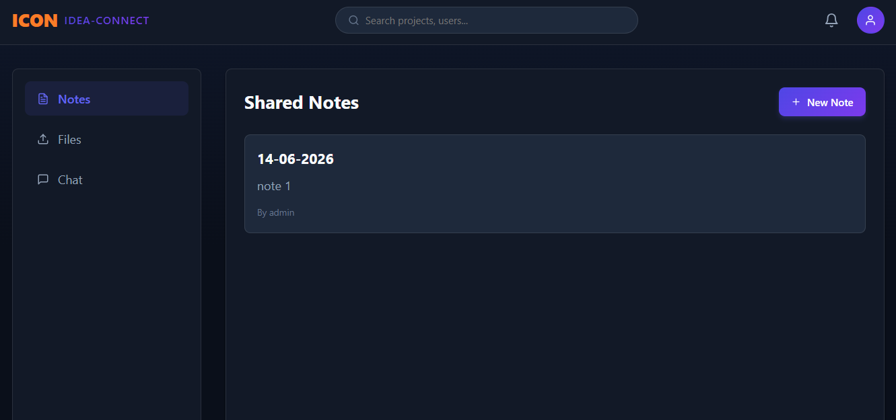
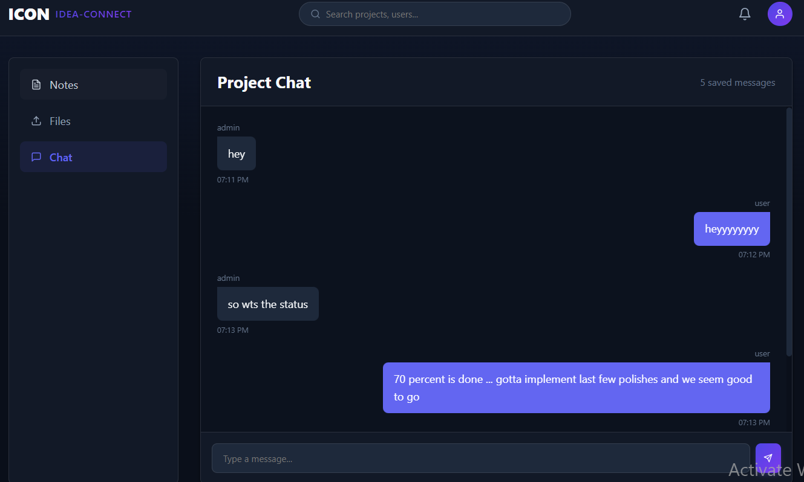

# ICON - Idea-CONnect

ICON, short for Idea-CONnect, is a full-stack project collaboration platform built using React, Node.js, Express, MongoDB, and Socket.IO. It allows users to create project spaces, discover public projects, request to join teams, collaborate inside shared workspaces, upload files, and communicate through persistent real-time project chat.

The project is designed as a local working MVP for a web technologies course/internship-level portfolio project.

## Features

- User registration and login with JWT authentication
- Password hashing using bcrypt
- Protected frontend and backend routes
- User profile editing with bio, domain, skills, and interests
- Project creation with public/private visibility
- Dashboard with separate sections for personal projects and discoverable public projects
- Project discovery for finding public projects and users
- Role-based project access control
- Project member roles: Admin, Lead, Editor, Member, Viewer
- Join request and invite workflow
- Request accept/reject handling
- Notification panel with pending requests and update notifications
- Mark-all-read notification action
- Shared project workspace
- Workspace notes
- File uploads using Multer
- Persistent project chat stored in MongoDB
- Real-time chat updates using Socket.IO
- Socket authentication using JWT
- Project membership checks before joining or sending chat messages
- Responsive dark-themed UI using CSS Modules

## Tech Stack

### Frontend

- React
- Vite
- React Router DOM
- Axios
- Socket.IO Client
- React Icons
- CSS Modules

### Backend

- Node.js
- Express.js
- MongoDB
- Mongoose
- Socket.IO
- JSON Web Tokens
- bcryptjs
- Multer
- dotenv
- cors

## Project Structure

```text
ICON/
├── backend/
│   ├── config/
│   │   └── db.js
│   ├── controllers/
│   │   ├── authController.js
│   │   ├── projectController.js
│   │   ├── requestController.js
│   │   ├── userController.js
│   │   └── workspaceController.js
│   ├── middleware/
│   │   ├── auth.js
│   │   └── rbac.js
│   ├── models/
│   │   ├── Message.js
│   │   ├── Notification.js
│   │   ├── Project.js
│   │   ├── Request.js
│   │   ├── User.js
│   │   └── Workspace.js
│   ├── routes/
│   │   ├── authRoutes.js
│   │   ├── messageRoutes.js
│   │   ├── notificationRoutes.js
│   │   ├── projectRoutes.js
│   │   ├── requestRoutes.js
│   │   ├── uploadRoutes.js
│   │   ├── userRoutes.js
│   │   └── workspaceRoutes.js
│   ├── package.json
│   └── server.js
├── frontend/
│   ├── public/
│   ├── src/
│   │   ├── components/
│   │   ├── context/
│   │   ├── pages/
│   │   ├── App.jsx
│   │   ├── index.css
│   │   └── main.jsx
│   ├── package.json
│   └── vite.config.js
├── README.md
└── Project_Report.md
```

## Local Setup

### Prerequisites

- Node.js
- npm
- MongoDB running locally

The project expects MongoDB to be available at:

```text
mongodb://127.0.0.1:27017/icon
```

### Backend Setup

```bash
cd backend
npm install
npm run start
```

Create a `.env` file inside `backend/`:

```env
MONGO_URI=mongodb://127.0.0.1:27017/icon
PORT=5000
JWT_SECRET=your_local_secret
```

Backend runs at:

```text
http://localhost:5000
```

### Frontend Setup

```bash
cd frontend
npm install
npm run dev
```

Frontend runs at:

```text
http://127.0.0.1:5173
```

## Main Application Flow

1. A user signs up or logs in.
2. The user can create a project and becomes the Admin of that project.
3. Public projects are visible to other users through the dashboard and discovery page.
4. A user can request to join a public project.
5. The project Admin receives the request in the notification panel.
6. The Admin can accept or reject the request.
7. Accepted users become project members.
8. Members can enter the project workspace.
9. In the workspace, members can create notes, upload files, and chat.
10. Chat messages are saved in MongoDB and are also delivered live using Socket.IO.

## Backend API Overview

### Authentication

```text
POST /api/auth/register
POST /api/auth/login
GET  /api/auth/profile
PUT  /api/auth/profile
```

### Users

```text
GET /api/users
GET /api/users/:id
```

### Projects

```text
GET  /api/projects
POST /api/projects
GET  /api/projects/:id
PUT  /api/projects/:projectId
POST /api/projects/:projectId/members
```

### Workspace

```text
GET  /api/projects/:projectId/workspace
POST /api/projects/:projectId/workspace/notes
PUT  /api/projects/:projectId/workspace/notes
POST /api/projects/:projectId/workspace/resources
```

### Chat Messages

```text
GET /api/projects/:projectId/messages
```

### Requests

```text
GET  /api/requests
POST /api/requests/join
POST /api/requests/invite
PUT  /api/requests/:requestId
```

### Notifications

```text
GET /api/notifications
PUT /api/notifications/:id/read
PUT /api/notifications/read-all
```

### Uploads

```text
POST /api/upload
```

## Real-Time Chat

Socket.IO is used for real-time project chat.

The socket connection is authenticated using the same JWT token used for HTTP routes. The backend verifies the token before allowing a socket connection. It also checks project membership before allowing a user to join a project room or send a chat message.

Main socket events:

```text
join_project
send_message
receive_message
chat_error
```

Chat messages are stored in the `Message` collection and loaded through:

```text
GET /api/projects/:projectId/messages
```

## Screenshots

### Login Page


### Dashboard



### Project Page



### Workspace Notes



### Workspace Chat



### Notifications


## Current Limitations

- The application is configured for local development and has not been deployed.
- Uploaded files are stored locally in the backend `uploads` directory.
- File storage is suitable for local/demo use, but production use should move uploads to Cloudinary, AWS S3, or another cloud storage provider.
- There are no automated tests yet.
- Notifications are implemented for requests, accept/reject updates, and chat messages, but not for every workspace action.
- Notes are saved and shared, but they are not a full collaborative document editor.

## Future Scope

- Cloud file storage using Cloudinary or AWS S3
- Task board inside each project workspace
- Project activity timeline
- Better notification filtering
- Message read receipts
- Automated tests for backend APIs
- Deployment using Render and MongoDB Atlas
- Optional AI assistant for summarizing project notes and chat

## Project Status

ICON is a working local MVP with authentication, projects, RBAC, requests, notifications, file uploads, workspace notes, and persistent real-time chat.
